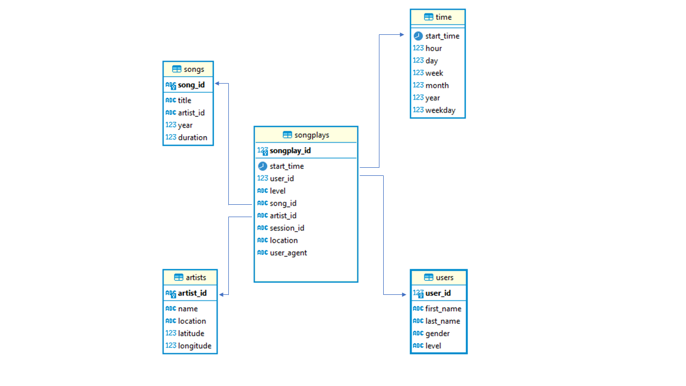

# Data Modeling in Postgres - FGastaldello submission

## Purpose/Goals
This project is used as a simple exercise to verify the concepts learned in the first module of the Data Enginnering Nanodegree on Udacity.
A data model for a Postgres database has been implemented conceptually with the definition of fact and dimension tables. The ETL pipeline has been developed using Python.

## Schema design

### Main design

The databse `sparkifydb` holds information about songs played and relative metadata. The Star schema is made of:

 - *fact table*: `songplays`
 - *dimension tables*: `songs`, `users`, `time` and `artists`
 
The creation/deletion of tables is done via the `create_tables.py`, based on the `sql_queries.py` script.
Along with `CREATE TABLE`, `DROP TABLE` and `INSERT` statements, the script has a `song_select` query that can retrieve the *song_id* and *artist_id* for the `songplays` table.

The ETL pipeline reads files inside the `/data` folder, which is organized to hold song data in `/data/song_data` and metadata in `/data/log_data`.
All files are in JSON format and these are manipulated via the `etl.py` script by using Pandas, a popular library for data manipulation for Python.

## Query examples